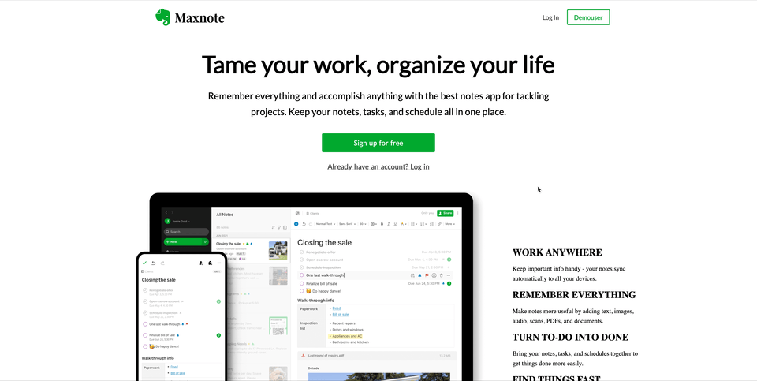

# Maxnote 📚 

Maxnote is a clone of the popular note-taking application - [Evernote](https://evernote.com/). The Maxnote features creating, reading, editing, and removing notes and notebooks. The notes and notebooks are saved in the cloud using PostgreSQL and Amazon AWS.

**Live site:**  [Maxnote](https://maxnote.herokuapp.com/) 

## Wiki Link  ✅

* [Database Schema](https://github.com/FloraKho/MaxNote/wiki/Database-Schema)
* [Feature List](https://github.com/FloraKho/MaxNote/wiki/Feature-List)
* [User Stories](https://github.com/FloraKho/MaxNote/wiki/User-Stories)


## Tech Stack 👩‍💻 

**Frameworks, Platforms and Libraries:**

      

**Database:**


**Hosting:** 

 

**Packages:**
[Quill](https://github.com/quilljs/quill) 


## Preview 💚
### Landing Page


### Login Page


## Run Locally 🖥

#### Clone the project

```bash
  git clone https://github.com/FloraKho/MaxNote.git
```

#### Install dependencies

```bash
  pipenv install --dev -r dev-requirements.txt && pipenv install -r requirements.txt
```

#### Create a **.env** file 
```bash
   FLASK_APP=app
   FLASK_ENV=development
   SECRET_KEY=
   DATABASE_URL=
   S3_BUCKET=<your bucket name>
   S3_KEY=<Access key Id>
   S3_SECRET=<Secret access key>
```

#### Setup your PostgreSQL user, password and database
```bash
   CREATE USER <USERNAME> WITH PASSWORD 'password';
   CREATE DATABASE <DATABASENAME> WITH ONWER <USERNAME>;
```

#### Get into your pipenv, migrate your database, seed your database, and run your flask app


```bash
   pipenv shell
```

```bash
   flask db upgrade
```

```bash
   flask seed all
```

```bash
   flask run
```

#### Run the React App in development
```bash
   cd react-app
```
```bash
   npm install
```


